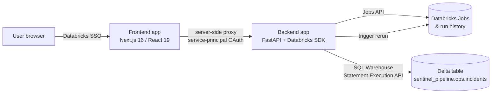

# Sentinel: Databricks Pipeline Observability & Remediation

**Catch failed Databricks jobs the moment they fail, decide what to do about them, and rerun them from one place, with a full audit trail of who approved what.**


<p align="center">
  
</p>

> Deployed as two Databricks Apps in a live workspace. Access is gated by Databricks SSO, so there is no public demo link. The frontend also runs locally on mock data in under a minute (see [Quick start](#quick-start)).

---

## What it does

When a Databricks job fails today, someone has to notice it, dig through the run logs, and decide whether to rerun it. Nothing ties the failure to how it was fixed. Sentinel closes that loop:

| Stage | What happens |
|---|---|
| **Monitor** | Job lists, run history, and KPIs (run counts, success rate, durations) pulled live from the Databricks Jobs API. No sample data. |
| **Detect** | Every read scans recent run history. Any new failed run becomes an incident in a Delta table the backend owns (`sentinel_pipeline.ops.incidents`). |
| **Classify** | Severity and error type come from documented, rule-based heuristics on the real task error output. `InfrastructureError` (cluster, timeout, memory, connection) suggests **RETRY**; everything else suggests **ESCALATE**. |
| **Remediate** | Safe, transient-looking failures are rerun automatically. HIGH-severity incidents, or jobs whose auto-retry has failed 3 times in a row, wait for a human to approve or reject. |
| **Verify** | Approving triggers a real rerun through the Jobs API. The backend tracks that specific run until it succeeds or fails, then resolves or escalates the incident. |
| **Audit** | Each rerun records whether it was human-approved or `auto-remediation`, so the trail always shows who authorized it. |

The full lifecycle (real failure, detection, approval, Databricks rerun, auto-resolve) has been run end to end against a live workspace.

## Architecture



- **Two Databricks Apps.** The frontend and backend are deployed separately in the same workspace.
- **No credentials in the browser.** Databricks Apps reject anonymous cross-app calls, so the frontend's own server exchanges a service-principal secret for a short-lived OAuth token and forwards each request to the backend. The browser only ever holds its own Databricks session cookie.
- **Mock and live modes share the same code.** Every service has a `Mock*Service` and an `Api*Service` behind one interface, selected by `NEXT_PUBLIC_USE_LIVE_API`.
- **Test pipelines included.** [`Backend/test_pipelines/`](Backend/test_pipelines) contains four jobs (always succeeds, always fails, transient failure, long-running) so every path in the incident lifecycle has real data to exercise.

## Quick start

**Frontend only, mock data (no Databricks needed):**

```bash
git clone https://github.com/uthrahh/Data-Pipeline-Sentinel.git
cd Data-Pipeline-Sentinel/Frontend
npm install
npm run dev
# open http://localhost:3000
```

**Full stack, live Databricks data:**

```bash
# 1. Backend
cd Data-Pipeline-Sentinel/Backend
python -m venv .venv
source .venv/bin/activate          # Windows: .venv\Scripts\activate
pip install -r requirements.txt
cp .env.example .env               # set DATABRICKS_HOST, DATABRICKS_TOKEN, DATABRICKS_WAREHOUSE_ID
uvicorn app:app --reload --port 8000

# 2. Frontend (new terminal)
cd Data-Pipeline-Sentinel/Frontend
cp .env.local.example .env.local   # sets NEXT_PUBLIC_API_URL=http://localhost:8000 and live mode on
npm install
npm run dev
```

Check the backend is up:

```bash
curl http://localhost:8000/api/health
curl http://localhost:8000/api/pipelines
curl http://localhost:8000/api/incidents/active
```

The incidents schema and table are created on first use (`CREATE ... IF NOT EXISTS`), so this is safe to run repeatedly.

Deployment details for Databricks Apps and Vercel are in [`Backend/README.md`](Backend/README.md) and [`Frontend/README.md`](Frontend/README.md).

## API

| Method | Endpoint | Purpose |
|---|---|---|
| `GET` | `/api/health` | Backend and workspace connectivity |
| `GET` | `/api/sql-warehouse/health` | SQL Warehouse reachability |
| `GET` | `/api/pipelines` | All monitored jobs |
| `GET` | `/api/pipelines/overview` | KPIs over a trailing window |
| `GET` | `/api/pipelines/{job_id}` / `/runs` | Job detail and run history |
| `GET` | `/api/incidents/active` / `/history` | Open and resolved incidents |
| `GET` | `/api/incidents/{id}` / `/by-run/{run_id}` | Incident lookup |
| `POST` | `/api/incidents/{id}/approve` | Approve, which triggers a real rerun |
| `POST` | `/api/incidents/{id}/reject` | Reject without rerunning |

## Why it's built this way

- **The platform stays honest about scope.** There's no LLM diagnosing failures yet, and that's deliberate. Classification is a small set of transparent rules, and the UI skips the investigation, data-quality, and SLA stages for live incidents rather than showing made-up analysis. A multi-agent investigation layer is designed but not built. I wanted every part of the system to be something I could prove works.
- **Incident state lives in Delta.** Databricks tracks runs, but not whether a human approved a fix. That's application state, so it gets its own governed table in a dedicated catalog with self-contained permissions.
- **Rerun is the only remediation.** It's the one action that's safe for any job without pipeline-specific logic. Guardrails (severity escalation, a 3-strike auto-retry limit) keep automation from masking a real problem.
- **Auth between apps is server-side only.** Rather than trusting the caller's browser session to carry authority it was never granted, the frontend authenticates to the backend with its own service-principal identity. The same proxy works unchanged on Vercel.

## Project structure

```
Backend/
  app.py                  FastAPI routes
  databricks_client.py    SDK client (PAT locally, app identity when deployed)
  services/               jobs, incidents (detection, classification, remediation), SQL
  test_pipelines/         Notebooks for the four test jobs
  app.yaml                Databricks App config
Frontend/
  src/app/                Next.js routes, incl. the api/proxy route
  src/services/           Mock* and Api* implementations behind shared interfaces
  src/lib/                liveMode flag, incident lifecycle stepper
  app.yaml                Databricks App config
```

---

Built by [Pavithra Uthrah R K](https://github.com/uthrahh) as a proof of concept during a data engineering internship at KaarTech. More on my [portfolio](https://uthrahrk.vercel.app).
