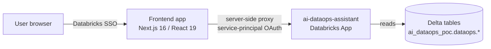

# Sentinel: Databricks Pipeline Observability & Incident Console

**A dashboard for SAP-sourced Databricks pipelines: pipeline health, data quality, and incident tracking — with the Overview, Pipeline Health, and Incidents pages pulling real, live data from a separately-deployed Databricks agent system.**


**Live app:** [sentinel-pipeline-frontend-7474652936146529.aws.databricksapps.com](https://sentinel-pipeline-frontend-7474652936146529.aws.databricksapps.com)

> Deployed as a Databricks App in a live workspace. Access is gated by Databricks SSO, so the live link only works for users granted `CAN_USE` in that workspace. To try it without an account, run it locally against fixture data (see [Quick start](#quick-start)).

---

## What it does

| Page | Data source | What it shows |
|---|---|---|
| **Overview** | Live | KPIs (pipelines run, failures, success rate, max duration, active incidents), the incident queue, and recent pipeline activity — all from the real `ai-dataops-assistant` API. |
| **Pipeline Health** | Live | Every real pipeline run in the trailing 24 hours, with its DQ status, SLA status, and any linked incident. |
| **Incidents** (list + detail) | Live | Every real incident (active + historical), including the raw AI-agent investigation text, DQ/SLA sub-results, guardrail decision, and recommended action, exactly as the source API returns them. |
| **Data Quality Check-up** | Static | Row counts, load freshness, and DQ pass/fail for the 7 real tables in `ai_dataops_poc.sap_demo`, snapshotted as fixtures. |
| **Notifications** | Static / simulated | A simulated notification-send flow (no real email is sent), for the DQ-breach approval demo. |

The live pages read from **`ai-dataops-assistant`**, a separate, already-existing Databricks App owned by another team, which runs its own multi-agent incident pipeline against `ai_dataops_poc.dataops.*` tables (pipeline runs, incidents, DQ/SLA checks). This app calls that system's API **read-only** — it does not trigger reruns, approvals, or remediations against it. The Data Quality and Notifications pages are deliberately kept static/simulated, grounded in real `sap_demo` table metadata pulled once and hardcoded as fixtures.

## Architecture


```mermaid
flowchart LR
    U[User browser] -->|Databricks SSO| FE[Frontend app<br/>Next.js 16 / React 19]
    FE -->|server-side proxy<br/>service-principal OAuth| EXT[ai-dataops-assistant<br/>Databricks App]
    EXT -->|reads| D[(Delta tables<br/>ai_dataops_poc.dataops.*)]
```

- **One Databricks App.** The frontend is the only app in this repo; the incident/agent backend it reads from (`ai-dataops-assistant`) is a separate deployment this repo does not own or contain.
- **No credentials in the browser.** Databricks Apps reject anonymous cross-app calls, so the frontend's own server (`src/app/api/proxy/[...path]/route.ts`) exchanges a service-principal secret for a short-lived OAuth token and forwards each request to `ai-dataops-assistant`. The browser only ever holds its own Databricks session cookie.
- **Mock and live modes share the same code.** `NEXT_PUBLIC_USE_LIVE_API` selects, per page, between the static fixture components and the live-fetching components — both live in the same route file (e.g. `overview/page.tsx` exports `MockOverview` or `LiveOverview`).

## Quick start

**Mock data, no Databricks needed:**

```bash
git clone https://github.com/uthrahh/Data-Pipeline-Sentinel.git
cd Data-Pipeline-Sentinel/Frontend
npm install
npm run dev
# open http://localhost:3000 — NEXT_PUBLIC_USE_LIVE_API is unset/false, so every page uses fixtures
```

**Live data**, against the real `ai-dataops-assistant` app, requires Databricks OAuth credentials with `CAN_USE` on that app — see [`Frontend/README.md`](Frontend/README.md) for the full env var list and deployment steps.

## Why it's built this way

- **No fabricated narrative.** The live incident detail page renders the source API's raw agent-investigation text as-is in its own panel, rather than force-fitting it into the mock model's structured `confidence/evidence/impact` shape — those fields would have to be invented, since the real API doesn't provide them.
- **Read-only against a shared system.** `ai-dataops-assistant` is owned and operated by a separate team; this app never calls its approve/reject/remediate endpoints, even though they exist, since those have real side effects (real job reruns, real table mutations) on a system this repo doesn't own.
- **Honest empty states.** The live API's pipeline-operations endpoint only looks back 24 hours; when nothing has run recently, Overview and Pipeline Health show an explicit empty state rather than reusing older or fictional data.
- **Auth between apps is server-side only.** The frontend authenticates to `ai-dataops-assistant` with its own service-principal identity via the proxy route — the caller's browser session never carries that authority directly.

## Project structure

```
Frontend/
  src/app/                Next.js routes, incl. the api/proxy route
  src/services/           liveApiService.ts (real ai-dataops-assistant calls) + apiClient
  src/lib/                liveMode.ts (the USE_LIVE_API flag), mapLiveIncident.ts (adapter
                           from the real API's row shapes to this app's display types)
  src/types/live.ts       Exact real API row shapes (LivePipelineOperation, LiveIncidentRow, ...)
  src/data/mock/          Fixtures for the static pages (Data Quality, Notifications) and for
                           mock-mode Overview/Pipeline Health/Incidents when running locally
  app.yaml                Databricks App config — DATABRICKS_APP_URL points at ai-dataops-assistant
Backend/
  (Legacy — see Backend/README.md. Not used by the deployed frontend; DATABRICKS_APP_URL
  now points at the separate ai-dataops-assistant app instead.)
```

---

Built as a proof of concept during a data engineering internship at KaarTech. More on my [portfolio](https://uthrahrk.vercel.app).
